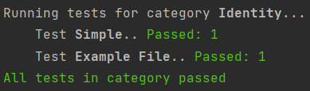

<a name="readme-top"></a>

<br />
<div align="center">
  <h3 align="center">jq-clone-tester</h3>

  <p align="center">
    A program for comparing the output of jq with the jq-clone
    <br />
    <br />
  </p>
</div>

<!-- GETTING STARTED -->
## Getting Started

Open in your favourite IDE (probably pycharm) and simply run main.py.
These will run some basics tests but more tests can (and should) be added under tests.py.
In there (and under <a href="#usage">Usage</a>) are explantation of how writing a test works. 
Adding new tests and test categories is hopefully pretty self explanatory. 
<br />
The generators (the thing that gives random ints, floats etc) are in the generators.py file.
There is also some examples in the README under <a href="#usage">Usage</a>.
From this it should be clear how to make additional generators if need be.

### Prerequisites
Only works on Windows for now but setting this line (in runners.py)
```
    get_data_command = "type" if ".json" in data else "echo"
```
to 
```
    get_data_command = "cat" if ".json" in data else "echo"
```
might make it work on Linux and macOS. Not sure though.

Made with Python 3.12 but probably works for most, not too old, versions.

<a name="usage"></a>
<!-- USAGE EXAMPLES -->
## Usage
A very basic use case would be this:
<br />
<br />
The command to be run is the identity_cmd (which is just ".").
The first test is simply ran on "1" and the second on the contents of the example.json file.
To run a test on a file simply pass in the path string (has to be a json file), 
and to run it on string, with json in it, simply pass in that string.
<br />
```python
# a path to a json file
example_file = os.path.join(data_files_path, "example.json")

identity_tests = {
    "Identity": [
        Test("Simple", cmd=".", data="1"),
        Test("Example File", cmd=".", data=example_file),
    ]
}
```

<br />

This would hopefully lead to these results:
<br />

<br />
<br />
<br />
it is also possible to run a "MultiTest" which is a test that runs commands with randomly generated values in them. 
The picture below shows an example of three different MultiTests ran on the test_array. 

The first command is the index_cmd which takes a random value x,
which would lead to commands like .[4] or .[-2.1] depending on the generator.
So for the first MultiTest called "Floats" a generator
that generates random floats between -10 and 10 is used. For the one called Ints it's integers between -10 and 10, 
but there is also a condition that makes sure that it is only called with even numbers. 

The slice_cmd takes a list or tuple of length 2 and puts the first element behind the : and the second behind it. 
The generator provides this array of length 2 with random integers between -10 and 10. Would lead to commands like .[1:4] or .[3:-1].

``` python
# the jq command to be run
index_cmd = lambda x: f".[{x}]"
slice_cmd = lambda xs: f".[{xs[0]}:{xs[1]}]"

# the json to run the command on (in this case just an array)
test_array = "[1, 2, 3, 4, 5]"

array_tests = {
    # the test category
    "Array Index Tests": [
        # instances of tests
        MultiTest("Floats", index_cmd, test_array, generator=gen_float(-10, 10)),
        MultiTest("Ints", index_cmd, test_array, generator=gen_int(-10, 10), condition=lambda x: x % 2 == 0),
    ],
    "Array Slice": [
        MultiTest("Ints", slice_cmd, test_array, generator=gen_array(gen_int(-10, 10), length=2)),
    ],
}
```
<br />
<br /> 
Running these tests might lead to these results. The array index tests passed for 25 random integers and 25 random floats.
The slice failed on the first test for the reason stated in the test results.
<br /> 


<br />
<br />
The generators are in the generators.py file (examples below), and new ones might need to be made to fit your test case.
Boolean conditions like the ones in QuickCheck can also be passed into the test (example above, in the Ints test).
It is, however, just like in QuickCheck, recommended to make new generators instead of having conditions when the condition is not
very likely to happen (otherwise it takes a long time generate enough tests). 
<br />
<br />
Here are some example generators:
<br />
```python
def gen_bool():
    return lambda: random.choice([True, False])


def gen_letter():
    return lambda: random.choice(string.ascii_letters)


# composite generators

def gen_string(length=STD_STRING_LENGTH):
    return lambda: ''.join([gen_letter()() for _ in range(length)])
```
<br />


<p align="right">(<a href="#readme-top">back to top</a>)</p>


<!-- ROADMAP -->
## Roadmap

- [ ] Add a roadmap

<p align="right">(<a href="#readme-top">back to top</a>)</p>


<!-- CONTRIBUTING -->
## Contributing

If you have a suggestion that would make this better just mail the suggestion 
or see https://gist.github.com/MarcDiethelm/7303312 for a guide on how to contribute on github

<p align="right">(<a href="#readme-top">back to top</a>)</p>


<!-- CONTACT -->
## Contact

Emil Malmsten - e.l.malmsten@student.tudelft.nl

<p align="right">(<a href="#readme-top">back to top</a>)</p>


<!-- MARKDOWN LINKS & IMAGES -->
<!-- https://www.markdownguide.org/basic-syntax/#reference-style-links -->

